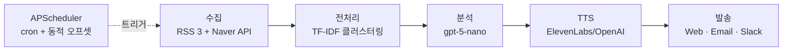

# 서신 · 書信 — 발표 자료 Source Document

> Claude cowork(claude.ai)에 이 파일을 업로드하면 7장 발표 슬라이드를 생성할 수 있도록 정리한 원본.

---

## ▼ Claude에게 보낼 프롬프트

```
아래는 과제 발표 자료의 원본 정보야.
이 내용으로 7장 발표 슬라이드를 만들어줘.

요구사항:
- 정확히 7장
- 각 슬라이드: 대제목 + 불릿 3~4개 + 필요시 Mermaid 다이어그램 또는 표
- 톤: 담백하고 기술적. 감성적 카피/은유 금지. 사실 중심.
- 배색: 무채색 + 단일 포인트 컬러 (네이비 또는 다크 그린). 미니멀.
- 스피커 노트는 각 슬라이드당 2~3줄 짧게.
- 코드 스니펫은 최대 1~2장에만 간결히 포함.
```

---

# 슬라이드 구성 (총 7장)

---

## S1. 전체 흐름 요약

**서신 — 뉴스 수집·분석·발송 자동화 시스템**



- **입력**: 카테고리별 공개 뉴스 60-80건
- **처리**: 중복 제거 → 클러스터링 → 상위 3건 선별 → LLM 요약 + 라디오 스크립트 → TTS
- **출력**: 카테고리별 리포트 + mp3, 3개 채널 동시 발송
- **자동화**: 사용자 설정 시각에 스케줄러 실행 (카테고리 수 × 1분 만큼 앞당겨 시작)

**스피커 노트**: 전체 시스템의 데이터 흐름입니다. 각 단계는 이후 슬라이드에서 상세히 설명합니다.

---

## S2. 기사 수집 + 클러스터링

**공개 API 4종 + TF-IDF 기반 주요 이슈 자동 추출**

**수집 소스**

| 소스 | 접속 방식 | 카테고리당 수집량 |
|---|---|:---:|
| 연합뉴스 RSS | 본사 직접 | ~20건 |
| 서울신문 RSS | 본사 직접 | ~12건 |
| Google News RSS | 키워드 aggregator | ~20건 |
| Naver Search API | 공식 JSON API | ~20건 |

- **2단 dedup**: URL 기준 → `normalize_title()` 로 `[종합]`/`[속보]`/`- 매체명` 제거 후 제목 기준
- 크롤링 0%, 전부 공식 공개 엔드포인트

**클러스터링 알고리즘**

- 입력 텍스트: `{title} {title} {summary[:300]}` (제목 2배 가중)
- TF-IDF: `ngram_range=(1,2)`, `sublinear_tf=True`
- Greedy clustering: 코사인 유사도 ≥ `0.45`
- 대표 선별: 클러스터당 서로 다른 매체 최대 3건
- **Top-N 선별: 클러스터 크기 내림차순 상위 3개** (크기 = 보도 매체 수 = 중요도 signal)
- Post-select 안전망: pairwise 유사도 ≥ `0.55` 면 교체 (최대 4회)

**효과**

- 60-80건 → 최종 3건으로 축약
- LLM 호출 비용 약 95% 절감 ($3.60 → $0.18 / 발송)

**파일**: `backend/pipeline/{collector,preprocessor}.py`

**스피커 노트**: "같은 이슈를 여러 매체가 동시 보도 = 공영 중요도 높음" 이라는 가설을 통계적으로 구현. LLM은 의미 이해, 코드는 중요도 판정으로 역할 분리.

---

## S3. LLM 사용한 기능

**gpt-5-nano 단일 모델 + 2단 프롬프트 체인**

**모델 선택**

- 과제 허용 모델 목록 중 `gpt-5-nano` 채택
- 이유: 저비용 + 한국어 품질 + 프롬프트 엔지니어링으로 한계 극복 가능성 검증

**2단 프롬프트 체인**

1. **analyzer** (기사 3건 → 핵심 요약)
   - 입력: 카테고리 + 대표 기사 3건 (제목 + 요약)
   - 출력: 3줄 핵심 포인트
2. **radio_script** (요약 → 낭독 스크립트)
   - 출력: 2~3분 분량 / 1000~1500자 / "사실 → 배경 → 영향" 구조

**프롬프트 엔지니어링 포인트**

- `gpt-5-nano` 는 temperature 파라미터 미지원 → **응답 구조를 프롬프트로 강제** (고정 섹션 + 길이 제약)
- 한국어 낭독 최적화: 숫자 단위 풀어쓰기 ("1,200명" → "천이백 명"), 외래어 한글 + 원어 1회 병기
- Few-shot 예시 1개로 조사 오류 방지

**백엔드 단일 호출**

- 모든 LLM 호출은 FastAPI 백엔드에서만 실행
- 프론트엔드 번들에 OpenAI/Anthropic URL 0건 (`grep` 검증)

**파일**: `backend/prompts/{analyzer,radio_script}.py`, `backend/pipeline/analyzer.py`

**스피커 노트**: 큰 모델을 쓰는 것이 아니라 작은 모델을 프롬프트 설계로 짜내는 접근. temperature 제약을 구조화 응답으로 우회.

---

## S4. 오디오 발송

**3채널 병렬 + TTS 엔진 2종**

**채널별 구현**

| 채널 | 구현 | 오디오 전달 방식 |
|---|---|---|
| Web 대시보드 | Next.js 16 + SSE 실시간 진행률 | `<audio>` 엘리먼트 직접 재생 |
| Email | SMTP (Gmail App Password) + HTML 본문 | 카테고리별 mp3 첨부 |
| Slack | Webhook 또는 Bot Token 2모드 | Bot 모드: `files.upload_v2` → 스레드 인라인 재생 |

**TTS 엔진 선택**

- **ElevenLabs** `eleven_multilingual_v2` (메인, 한국어 자연스러움 우수)
- **OpenAI** `gpt-4o-mini-tts` (폴백, 리허설/비용 관리용)
- 사용자가 설정 페이지에서 엔진 토글 가능

**캐시 전략**

- 파일명: `{report_id}.{engine}.mp3`
- 엔진 전환 시에도 캐시 충돌 없음, 재생성 불필요

**Slack Bot 업로드 플로우 (3단계)**

```
1. files.getUploadURLExternal  → 업로드 URL 발급
2. POST bytes to upload URL     → 파일 전송
3. files.completeUploadExternal → 채널 + thread_ts 에 첨부
```

**파일**: `backend/services/tts.py`, `backend/dispatcher/{email_sender,slack}.py`

**스피커 노트**: 이메일/슬랙에서 스크롤 없이 바로 재생 가능. 엔진 교체는 파일명만 다르게 저장해 캐시 일관성 유지.

---

## S5. 사용한 AI 도구

**실행 AI (런타임) + 개발 AI (개발 도구) 구분 공개**

**실행 AI — 프로덕션 파이프라인에서 호출**

| 도구 | 역할 | 모델명 |
|---|---|---|
| OpenAI | LLM 분석 + 라디오 스크립트 | `gpt-5-nano` |
| OpenAI | TTS 폴백 | `gpt-4o-mini-tts` (voice: nova) |
| ElevenLabs | TTS 메인 | `eleven_multilingual_v2` |

- LLM 호출은 **백엔드에서만 수행**, 프론트엔드 직접 호출 0건

**개발 AI — 코드 작성에 사용**

| 도구 | 역할 |
|---|---|
| Claude Code (Anthropic) | 주요 개발 파트너. PDCA 사이클 전 단계 (설계 / 백엔드 / 프론트엔드 / 디버깅) |
| v0.app (Vercel) | 초기 대시보드 UI 스캐폴드 — 이후 Claude Code 와 수동 리팩토링 |

**개발 플로우**

```
Day 1-2: 백엔드 파이프라인 (수집 → 클러스터링 → LLM)
Day 3  : 프론트엔드 대시보드 + 설정 페이지
Day 4  : 멀티채널 발송 + TTS 통합
Day 5  : 스케줄러 + 오디오 첨부 + 아카이브 + 리허설
```

PDCA (Plan → Design → Do → Check → Act) 방법론으로 각 단계 문서화.

**스피커 노트**: 과제 요건 "AI 도구 사용 시 밝힐 것" 에 대한 투명한 답변. 개발 AI 사용은 숨기지 않고 역할을 분리해 공개.

---

## S6. 고도화 방안

**프로토타입에서 프로덕션으로 가는 경로**

**클러스터링**

- TF-IDF → **KoSentenceBERT / KLUE-RoBERTa 임베딩** 교체 (`_article_text_for_clustering()` 한 함수만 교체로 가능하게 설계됨)
- 의미 기반 유사도로 전환 시 "금리 인하 ↔ 경기 부양" 같은 인과 관계도 포착

**인프라**

- SQLite → **PostgreSQL** 이관 (SQLAlchemy Core 사용, 쿼리 수정 불필요)
- 배포: Vercel (프론트) + Render/Fly.io (백엔드) + Managed DB

**사용자 기능**

- JWT 인증 + 회원가입 → 멀티유저 지원
- 개인화 랭킹: 사용자가 읽은/스킵한 리포트 기반 Embedding 재정렬
- 매체 커스터마이징: 특정 언론사 제외/우선 선택

**플랫폼 확장**

- React Native 모바일 앱 (오디오 백그라운드 재생 + Push 알림)
- 기업용 버전: 팀 단위 구독 + 업무 도메인 키워드 필터 (법조/금융/헬스케어)

**TTS**

- 오픈소스 TTS (XTTS, Kokoro) 로 단가 제로화 검토
- 사용자 음성 선택권 확대 (목소리 샘플 미리듣기)

**스피커 노트**: 현재 구조의 확장 용이성을 강조. 코드 일부만 교체하면 대부분의 고도화가 가능한 설계.

---

## S7. 마무리

**감사합니다**

- 저장소: `github.com/Yangms30/news_briefing`
- 핵심 문서
  - `plan.md` — 설계 소스 오브 트루스
  - `docs/05-pipeline/clustering-deep-dive.md` — 클러스터링 심층 문서
  - `docs/04-report/briefbot-submission-report.md` — 제출 리포트
- 질문 환영합니다.

**스피커 노트**: 저장소와 문서 위치 안내 후 Q&A.

---

# 부록 — 핵심 파일 경로

*(Claude cowork 가 다이어그램이나 예시 코드 생성 시 참조)*

**백엔드**
- `backend/main.py` — FastAPI + lifespan + scheduler
- `backend/scheduler.py` — APScheduler + 동적 오프셋
- `backend/pipeline/collector.py` — 4소스 수집 + dedup
- `backend/pipeline/preprocessor.py` — TF-IDF 클러스터링
- `backend/pipeline/analyzer.py` — LLM 호출
- `backend/prompts/{analyzer,radio_script}.py` — 프롬프트
- `backend/services/tts.py` — 엔진 pluggable TTS
- `backend/dispatcher/{service,email_sender,slack}.py` — 발송

**프론트엔드**
- `frontend/app/dashboard/page.tsx` — 메인 대시보드
- `frontend/app/dashboard/settings/page.tsx` — TTS 엔진 + 채널 설정
- `frontend/app/dashboard/history/page.tsx` — 발송 이력
- `frontend/lib/api.ts` — 백엔드 클라이언트 (LLM 직접 호출 0건)

**문서**
- `plan.md` · `CLAUDE.md` · `docs/05-pipeline/clustering-deep-dive.md`

---

# 발표 타이밍 (참고)

```
S1 전체 흐름           30~45초
S2 수집 + 클러스터링    90초 (핵심)
S3 LLM 기능            60초
S4 오디오              60초
S5 AI 도구             45초
S6 고도화 방안          45~60초
S7 마무리              15초
───────────────────────
합계 약 6~7분 (Q&A 제외)
```
